# UX flow — `new-demo.ps1`

This is the script the generator runs. Use this doc to review the flow with
your teammate before they touch the code. Each step shows the prompt, the
default the user can accept by pressing Enter, and what the generator does
with the answer.

## Flowchart

```mermaid
flowchart TD
    Start([pwsh .\new-demo.ps1]) --> Detect[Detect silicon via WMI<br/>-> default arch + model alias]
    Detect --> Q1[Q1. Demo name<br/>default: MyAIDemo]
    Q1 --> Q2{Q2. Source harness?}
    Q2 -->|Local| LH[Copy src\LocalAIDevHarness]
    Q2 -->|Hybrid| HH[Copy src\HybridAIDevHarness<br/>+ cloud router]
    LH --> Q3
    HH --> Q3
    Q3{Q3. Architecture?} -->|x64| A1[RuntimeIdentifiers=win-x64]
    Q3 -->|ARM64| A2[RuntimeIdentifiers=win-arm64]
    Q3 -->|both| A3[win-x64;win-arm64]
    A1 --> Q4
    A2 --> Q4
    A3 --> Q4

    Q4{Q4. Industry?<br/>10 + N/A} --> Q5
    Q5{Q5. Modality?}
    Q5 -->|text| M1[text only]
    Q5 -->|vision| M2[hasVision=true]
    Q5 -->|audio| M3[hasAudio=true]
    Q5 -->|all| M4[hasVision + hasAudio]

    M1 --> Q6
    M2 --> Q6
    M3 --> Q6
    M4 --> Q6

    Q6[Q6. TEXT model alias<br/>default: silicon-aware<br/>phi-4-mini / qwen2.5-3b] --> Q7v{hasVision?}
    Q7v -->|yes| Q7[Q7. VISION model alias<br/>default: phi-3.5-vision]
    Q7v -->|no| Q7a
    Q7 --> Q7a{hasAudio?}
    Q7a -->|yes| Q7b[Q7b. AUDIO model alias<br/>default: whisper-base]
    Q7a -->|no| Q8
    Q7b --> Q8

    Q8{Q8. Mock mode ON<br/>at first launch?}
    Q8 -->|yes| MockOn[AppHost static ctor:<br/>Settings.UseMock = true]
    Q8 -->|no| Q9
    MockOn --> Q9

    Q9{Q9. Use cases?<br/>multiline or N/A} --> TabLogic

    TabLogic{Tab generation}
    TabLogic -->|Industry=N/A + UseCases=N/A| TG1[1 generic Chat tab]
    TabLogic -->|Industry set + UseCases=N/A| TG2[Industry catalogue tabs<br/>e.g. Healthcare:<br/>Triage / Shift Handoff /<br/>Family Update / Visit Audio*]
    TabLogic -->|UseCases given| TG3[One tab per use case<br/>w/ industry-context prelude]

    TG1 --> Append
    TG2 --> Append
    TG3 --> Append

    Append{Append modality tabs}
    Append -->|hasVision| AV[+ Image Notes vision tab]
    Append -->|hasAudio| AA[+ Audio Notes tab<br/>Transcribe / Translate mode]
    Append --> Stamp

    Stamp[Stamp demos\Name\<br/>- sln/csproj<br/>- MainWindow nav + switch arms<br/>- Pages\TabPage.xaml + .cs<br/>- App.xaml.cs exposes MainWindow<br/>- Package.appxmanifest<br/>- README + .gitignore]

    Stamp --> Q10{Q10. Init git?}
    Q10 -->|no| Done
    Q10 -->|yes| GitInit[git init -b main<br/>+ initial commit]
    GitInit --> Q11{Q11. GitHub repo<br/>owner/name?}
    Q11 -->|blank| Done
    Q11 -->|filled| GhCreate[gh repo create --public<br/>--source=. --push]
    GhCreate --> Done

    Done([dotnet build and run])

    classDef q fill:#e3f2fd,stroke:#1976d2,color:#000;
    classDef action fill:#f3e5f5,stroke:#7b1fa2,color:#000;
    classDef done fill:#c8e6c9,stroke:#388e3c,color:#000;
    class Q1,Q2,Q3,Q4,Q5,Q6,Q7,Q7b,Q8,Q9,Q10,Q11,Q7v,Q7a,TabLogic,Append q;
    class Detect,LH,HH,A1,A2,A3,M1,M2,M3,M4,MockOn,TG1,TG2,TG3,AV,AA,Stamp,GitInit,GhCreate action;
    class Start,Done done;
```



\* Industry-catalogue audio tab only stamped when modality includes audio.

## Cold open

```
----------------------------------------------------------------------
 AI-Dev-Harness . new-demo.ps1
----------------------------------------------------------------------
Detected silicon: Intel(R) Core(TM) Ultra 7 268V
  -> Recommended build arch: x64
  -> Recommended Foundry model alias: phi-4-mini
```

The script reads `Win32_Processor` via WMI before asking anything. The
recommendation feeds the defaults below; the user can override every one.

## The 9 questions

| # | Prompt | Default | What happens with the answer |
|---|---|---|---|
| 1 | `Demo name (e.g. HoustonTriage)` | `MyAIDemo` | Sanitised to an identifier (letters/digits only). Becomes the solution name, root namespace, assembly name, MSIX identity, and folder name under `demos\`. |
| 2 | `Local-only or Hybrid (adds cloud router) [Local/Hybrid]` | `Local` | Picks which reference harness (`src\LocalAIDevHarness` or `src\HybridAIDevHarness`) is copied as the starting point. |
| 3 | `Build architecture [x64/ARM64/both]` | matches detected silicon | Sets `<RuntimeIdentifiers>` in the generated csproj. `both` produces win-x64 + win-arm64. |
| 4 | `Pick an industry focus`<br/>numbered list of 10 + `N/A` | `N/A` | Seeds the system-prompt prelude with industry context (e.g. "operate inside a regulated clinical environment"). If user also says N/A to use cases, the generator stamps out the catalogue tabs for that industry. |
| 5 | `Modality (text / vision / audio / all)` | `text` | `text` generates `StreamingChatView` pages only. `vision` adds image-picker pages. `audio` adds audio-picker pages with Transcribe / Translate modes. `all` adds both. (Legacy value `both` is accepted as an alias for `vision`.) |
| 6 | `Foundry Local TEXT model alias (or N/A for detected default)` | silicon-aware default (`phi-4-mini` Intel/AMD/unknown, `qwen2.5-3b` Qualcomm) | Baked into the demo's `AppHost.cs` as the default model alias. User can still change it later via Settings. |
| 7 | (only if modality includes vision) `Foundry Local VISION model alias (or N/A for default)` | `phi-3.5-vision` | Baked into each vision page as `VisionModelAlias`. |
| 7b | (only if modality includes audio) `Audio (Whisper) model alias for transcription/translation (or N/A for default)` | `whisper-base` | Baked into each audio page as `AudioModelAlias`. Each audio page exposes a `Transcribe` / `Translate (to English)` mode selector. |
| 8 | `Start with Mock mode ON? (safe for live demos) [yes/no]` | `no` | If `yes`, the generated `AppHost.cs` sets `Settings.UseMock = true` in its static constructor so the first launch is always safe. |
| 9 | `Identified use cases - one per line` (multiline, end with blank line, or single `N/A`) | `N/A` | Drives tab generation (see below). |

Then one closing question:

| # | Prompt | Default | What happens |
|---|---|---|---|
| 10 | `Initialise git repo for the new demo? [yes/no]` | `yes` | If yes: `git init -b main`, writes `.gitignore`, makes an initial commit. |
| 11 | (only if 10 = yes) `GitHub repo to create (owner/name, blank to skip)` | empty | If filled: runs `gh repo create <owner/name> --public --source=. --push`. Requires the `gh` CLI; skipped with a printed warning if not installed. |

## How the answers compose into tabs

```
Industry == N/A      AND  UseCases == N/A   ->  1 generic Chat tab (+ vision tab if modality != text)
Industry == Healthcare AND UseCases == N/A   ->  Triage, Shift Handoff, Family Update
Industry == Banking    AND UseCases == N/A   ->  Customer Assistant, Pre-Qual Helper, Money Insights
... etc. for each industry ...
Industry != N/A       AND UseCases given     ->  one tab per use case, system prompts get the
                                                  industry-context prelude appended
Industry == N/A       AND UseCases given     ->  one tab per use case, generic prompts
```

Vision/Audio tabs are added in two cases:
- Modality includes vision/audio AND the industry catalogue includes a matching tab (currently: Insurance "Photo Notes" - vision; Healthcare "Visit Audio" - audio; Legal "Deposition Audio" - audio).
- Modality includes vision/audio AND the user supplied use cases - an extra "Image Notes" (vision) and/or "Audio Notes" (audio) tab is appended.

## What the generator stamps out

```
demos\<Name>\
  <Name>.sln                          ← references ..\..\src\Shared\Shared.csproj
  README.md                           ← per-demo, captures every answer + skunkworks disclaimers
  .gitignore                          ← bin/, obj/, AppPackages/, .vs/, *.user
  <Name>\
    AppHost.cs                        ← Mock-on baked in if you said yes; model alias baked in
    MainWindow.xaml                   ← <NavigationView.MenuItems> rewritten with your tabs
    MainWindow.xaml.cs                ← NavView_SelectionChanged rewritten with your switch arms
    Package.appxmanifest              ← identity / display name = <Name>
    Pages\
      AboutPage.xaml(.cs)             ← inherited from harness, untouched
      SettingsPage.xaml(.cs)          ← inherited (already has Mock toggle)
      <Tab1>Page.xaml(.cs)            ← generated text tab using StreamingChatView
      <Tab2>Page.xaml(.cs)            ← generated text tab
      <Tab3>Page.xaml(.cs)            ← generated vision tab if applicable
    (everything else from the source harness is kept as-is)
```

## Side effects you should know about

- **Working dir for the script is the AI-Dev-Harness repo root.** It writes
  only to `demos\<Name>\` and (if you said yes to git) creates a git repo
  scoped to that folder. The harness sources in `src\` are never modified.
- **`gh` is invoked only at the very end** and only if the user gave a repo
  name. If `gh` is missing the generator prints a one-liner the user can
  paste later instead.
- **No model download happens during generation.** The first time the user
  runs the generated app and triggers a chat call, the Foundry Local SDK
  may download the model. Expect 30-60 seconds on first token. Mock mode
  bypasses this entirely.

## Non-interactive mode (for CI / scripted onboarding)

Every prompt has a matching parameter, so the same flow can be replayed:

```powershell
.\new-demo.ps1 `
  -Name HoustonTriage `
  -Source Local `
  -Architecture x64 `
  -Industry 'Healthcare' `
  -Modality all `
  -ModelAlias phi-4-mini `
  -VisionModelAlias phi-3.5-vision `
  -AudioModelAlias whisper-base `
  -MockByDefault `
  -UseCases @('Triage incoming patients','Summarise shift handoff','Family-friendly update') `
  -InitGit `
  -GitHubRepo 'npuneil/HoustonTriage' `
  -NonInteractive
```

## What to review with the teammate

1. Are the 9 questions in the right order, with the right defaults?
2. Are the industry-catalogue prompts good enough as a starting point, or
   should we expand the per-industry tab list?
3. Should we add a question for theme / brand colour at generation time, or
   leave that to a follow-up "rebrand" script?
4. Should the generator also stamp out a starter `demo_data\` folder
   pre-populated per industry?
5. Does the vision page stub (file picker + preview only) need to call a
   real vision model out of the gate, or is a follow-up swap-in fine?
